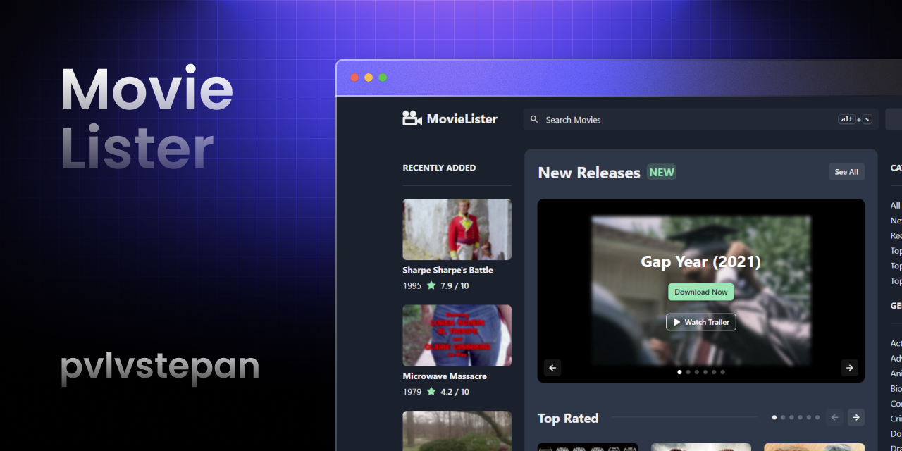

# MovieLister



[](https://github.com/pvlvstepan/movie-lister/actions/workflows/pages/pages-build-deployment)

MovieLister is a single-page application that fetches and displays movies from the YTS.mx API. It's designed for movie enthusiasts who want a simple and user-friendly way to explore and discover new films.

## Features

- Browse a wide selection of movies.
- Search for specific movies by title.
- View detailed movie information, including ratings, synopsis, and release year.
- Responsive design for a seamless experience on both desktop and mobile devices (dark mode friendly).

## Installation

To run MovieLister locally, follow these steps:

1. Clone the repository:

   ```bash
   git clone https://github.com/pvlvstepan/movie-lister.git
   cd movie-lister
   ```

2. Install dependencies (Node.js v12 or higher, but not higher than v16 is required):

   ```bash
   npm install
   ```

3. Start the development server:

   ```bash
   npm start
   ```

4. Open your web browser and navigate to `http://localhost:3000` to access the application.


## Technologies Used

- [React](https://react.dev/)
- [React Router](https://reactrouter.com/)
- [Axios](https://github.com/axios/axios)
- [react-icons](https://react-icons.github.io/react-icons/)
- [chakra-ui](https://chakra-ui.com/)
- [YTS.mx API](https://yts.mx/api)

## License

This project is licensed under the MIT License - see the [LICENSE](LICENSE) file for details.

## Acknowledgments

- Special thanks to YTS.mx for providing the movie data.
- Built as a coding interview project for [MSU Bigdata Center](https://github.com/msubigdata).
